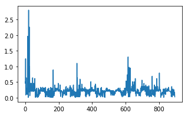
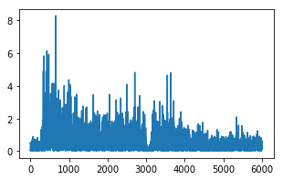
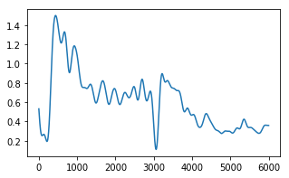
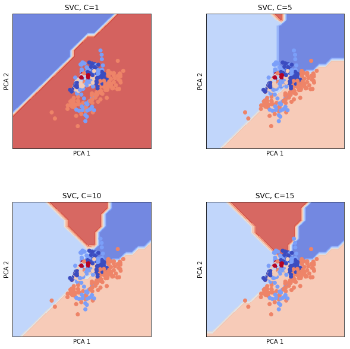
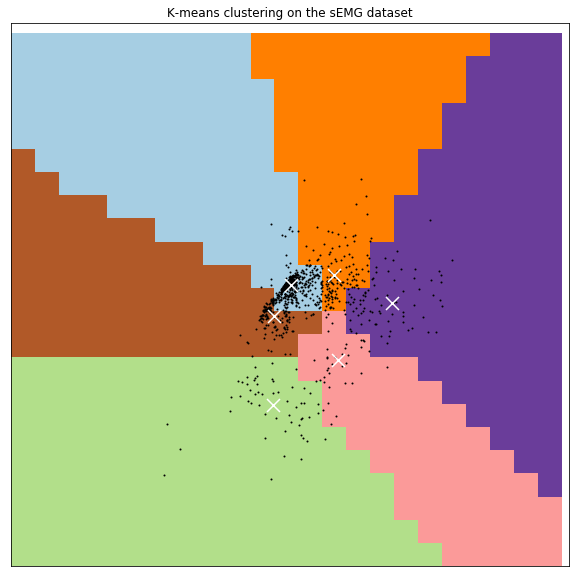
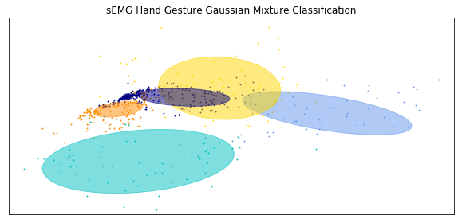

    <h1>EMG Classification for Hand Gestures</h1>
    <h3>Authors: Hayden Cornell, Numaer Zaker</h3>

# 1. Problem Statement

Our muscle movements and contractions generate currents that can be measured using a technique known as Electromyography (EMG). EMG has a wide variety of applications ranging from the medical industry, virtual reality, communication, and much more. A few current and potential applications are as follows:

* Exoskeleton - Use robotics to improve disabled users mobility or enhance soldiers endurance and strength by predicting extremity movements via sEMG signals
* Virtual Reality - Simulating various hand gestures within virtual reality would be accomplishable by classifying various  sEMG signals of different hand gestures
* Muscle Dysfunction - Identifying whether a patient has dysfunctional muscles on their arms to identify broader issues such as Dementia

Many times detecting certain hand gestures or even abnormalities can be difficult as they are often subtle or hard to measure. We tackle this issue in this report by using an sEMG dataset to try to classify a variety of hand gestures that are used on a day-to-day basis. We believe if we can successfully classify these gestures, our models could be used to detect abnormalities in patients or be used in virtual reality simulations.  

# 2. Data Source

For this analysis, we use the __sEMG for Basic Hand Movements Data Set__. This is an open source dataset that is available here:
* https://archive.ics.uci.edu/ml/datasets/sEMG%20for%20Basic%20Hand%20movements#. 

It contains two databases containing data of sEMG of various participants doing a variety of hand movements. There are six categories that these hand movements fall under:

* Spherical
* Tip
* Palmar
* Lateral 
* Cylindrical
* Hook

  
---

Each row in the dataset represents a single trial of recording sEMG data for the participants. sEMG data is recorded over time, so each column will represent a point in time for each trial. For our analysis, we only focus on the first database which has 5 participants, 6 hand signals, and 12 sensors. Our dataset will be a matrix with 900 data points and 6000 features. 

# 3. Methodology

Our methodology for building classification models will follow five high level steps:

1. Data preprocessing to eliminate noise and smooth data points. 
2. Dimensionality reduction with principal component analysis and ISOMAP.
3. Scale the data using standard scaling.
4. Building various model classifiers with support vector machines, k-means, gaussian-mixture, naive-bayes, logistic regression, and neural networks.
4. Hypertuning each model to select the best model via gridsearch and cross-validation.
5. Evaluate model performance against a test set and compare results.

## Data Processing and Transformation

### Preprocessing & Smoothing

We found the sEMG data to be very noisy which resulted in poor model classification performance without processing. In order to improve the quality of the data we performed two transformations:

* Apply the absolute value function to each datapoint to reduce standard deviation/volatility
* Apply Holt-Winters exponential smoothing to eliminate much of the noise in the data. 

The below set of images, from left to right, show how the data is processed to our preprocessing pipeline. 
* On the left we have the original EMG data from the raw data source
* In the middle, we have the EMG data after taking the absolute value
* The image on the right is what we use as input to the rest of the analysis for this report.

$$ $$
<table><tr>
<td>  </td>
<td>  </td>
<td>  </td>    
</tr></table>
$$ $$

The smoothing parameters were tuned and visually compared with the raw data to make sure the smoothed curve maintained the data trends while reducing the noise. The best smoothing level was 0.03 and the best smoothing slope is 0.02. The following is an example of a single datapoint after taking the absolute value and smoothing the output:

### Dimensionality Reduction with PCA and Isomap

Each datapoint has 6000 features where each feature represents a point in time. It's likely the case that many of these features are unlikely to improve the performance of our classification model. More specifically, many of the features will not explain the variance in the classification. Through principal component analysis (PCA), we chose the top components that explained most of the variance in our model. Similarly, we can also use Isomap, which is a nonlinear dimensionality reduction method. Both of these techniques are used with the first 2 components plotted for visual comparison.

$$ $$
<table><tr>
<td>  </td>
<td>  </td>
</tr></table>
$$ $$

The hand images are overlaid to show the hand motion that is associate with each color. As we can see, neither method is a clear "winner" for the dimensionality reduction. This can be expected since we will most likely want to use more than just 2 components for the classification, which is difficult to visualize. Since Isomap is more commonly used for datasets with high dimensionality, the following classification analysis will be done with the Isomap data, using the first 20 components. However, we also build models using 2 components to show the decision boundaries for a few of the models.

## Model Formulation, Creation, & Tuning

For this section, we formulate the equations used to build the model. We also create the model and tune them for the best accuracies using gridsearch and cross validation. We visualize some of the models by using two principal components to give us a better picture how these models vary from one another. The typical inputs for the best performant models is the data set with 20 components using ISOMAP.

### Support Vector Machine Classifier

We learned from the class that support vector machines can be used to separate datapoints using a variety of kernels. We believed that SVM would be a good model to try for this problem given that we have 6 different classes with high dimensionality. We formulas the hand gesture classification  problem for SVM as follows:

$$
\min_{w,b} \vert\vert w \vert\vert ^2 \\
\text{s.t.} y^i(w^T x^i +b) \geq 1, \forall i 
$$

In plain English, the formulation maximizes the soft margins between the 6 different hand gestures to minimize the overall training error. The above is the formulation for the linear kernel; but we try a variety of kernel as we suspect much of the features between the different hand gestures may overlap. A different kernel provides more flexibility to these noisy boundaries.

Using the generalized SVM formulation, we used SVM from sklearn to try a variety of parameters and kernels. The visuals were created using an SVM model with 2 PCA components so that we could visualize the decision boundaries. Below are decision boundaries for our model with a variety of parameters:

$$ $$
<table><tr>
<td>  </td>
</tr></table>
$$ $$

For the best performant model, we stuck with using 20 components from the ISOMAP and hypertuned the parameters. We explored various kernels, gamma values, margin values, and varying degrees.

### K-Means Clustering Classifier

K-Means clustering classification was one of the techniques we also used to try to predict hand gestures. K-Means is an unsupervised learning method that doesn't take in response labels. Instead, we encoded our labels into numbers (hand gestures from 1-6). The result of building our models and using PCA=2 can be seen below:

$$ $$

$$ $$

As you can see, we have 6 clusters that are color coded differently. The white X's represent the center of those clusters. We see that the model does a decent job separating the training points. However, one of the challenges we faced here was associating the original hand gesture labels to the clusters; this is because it is an unsupervised model.

### Gaussian-Mixture Model

We built a Gaussian-Mixture model because with the processed data, we believe that each class of hand gestures could be presented by a unimodal distribution using the top principal components. Our gaussian mixture model for this problem was formulated as the following:

We initialized $\pi_k = 1/m$, $\mu_k = 0$ and $\sum_k$ to be the identify matrix. Then we run the expectation-maximization algorithm below until we maximize the likelihood (convergence)

#### Expectation Step

The expectation step of the model is to calculate the best current probabilities of each data point given D, $\mu$, and $\sigma$.

$$
t^i_k = p(z^i_k = 1| D,\mu,\sigma) = \frac{\pi_k N(x_i|\mu_k,\sum_k)}{\sum_{k=1}^K\pi_k N(x_i|\mu_k,\sum_k)}
$$

#### Maximization Step

Then once we finish the expectation step to get the new $t_k^i$ , we update ($\pi_k, \mu_k, \sum_k)$ as follows:

$$
\pi_k = \frac{\sum_i \tau_k^i}{m}\\
\mu_k = \frac{\sum_i \tau_k^i x^i}{\sigma_i \tau_k^i} \\
\sum_k = \frac{\sum_i \tau^i_k (x^i - \mu_k)(x^i - \mu_k)}{\sum_i - \mu_k}
$$

The result of formulating and training the model can be seen seen below. On the left hand side, we plot the training data points. On the right hand side, we plot the testing data points. We see that there are 6 round (gaussian distributed) clusters made to cluster the points:

$$ $$
<table><tr>
<td>  </td>
<td>  </td>
</tr></table>
$$ $$

### Naive-Bayes Classifier

We built a Naive-Bayes classifier as well as another model of comparison. One of the assumptions of Naive-Bayes is that the predictors are all independent. Now we know this is clearly not the case with our dataset given that time series data is prone to autocorrelation, and hence each sequential feature is loosely related. We anticipated this model to perform the worst. We formulated the model using the general naive bayes classifer:

* Define the class priors: p(y), which is the likelihood of each hand gesture in the dataset
* Calculate the posterior probability of the training set using Bayes formula; more specifically given the features how often do they result in each of the classes:
  * $P(y=i | x) = \frac{P(x|y)P(y)}{P(x)}$
* Apply bayes decision rule where the class of the point would be the class with the highest posterior probability $P(y=i|x)$
* Maximize the likelihood of all the data points being the correct hand gesture

Naive-Bayes is an inherently simple model given all its basic assumptions about the data. There was little hypertuning done for NB and only needed to build it a few times to get consistent results.

### Multinomial Logistic Regression Classifier

Logistic Regression is a probabilistic classification technique that linearly combines features to construct a predictor function. Regression is performed on this function, similar to simple Linear Regression. In order to obtain probabilistic classification, the logistic function transforms this linear function. The generalized logistic function is as follows:

$$ p = \frac{1}{1 + e^x} $$

When this is applied to the multiple classifications and variables, the Multinomial Logistic Regression equation becomes:

$$ P(Y_i = K) = \frac{1}{1 + \sum_{k=1}^{K-1} e^{\beta_k X_i}} $$

where K represents the possible outcomes and must sum to 1. 

The major assumption for this model is that the data are case specific, where each independent variable has a single value for each case. Unlike Naive-Bayes, the independent variables do not need to be statistically independent from eachother (but the collinearity should be low).

### Neural Network Classifier

A simple feed-forward neural network model was the last model that was used to classify the sEMG data. There are a many different types of neural network models, but since we only went into detail on the simple feed-forward model that is what we used. See the image below for an illustration of this model.

This type of neural network is similar to logistic regression, in that the transformation function before the output uses the logistic function. The difference is that there are more "hidden" layers with resulting coefficients that need to be solved for. The inputs are the 6000 factors (sEMG readouts) from our data, and the output are one of the six hand motions. The hyperparameter that was altered was the number and size of the hidden layers. These values were tuned to find optimal accuracy.

# 4. Evaluation and Final Results

After hypertuning all of our models using gridsearch and cross validation, we chose the models that had the highest accuracies. Below are the results:

| Model               |  Accuracy | Standard Deviation | Rank |
|---------------------|----------|-------| ---- |
| SVM                 |  68%    |   3.3%    | 2 |
| K-Means             |   53%    |   6.3%   | 6 |
| Gaussian-Mixture    |   76%    |  11.4%   | 1  |
| Naive-Bayes         | 59%    |   3.4%  |  4 |
| Logistic Regression |  55%    |   2.6%    | 5 |
| Neural Network      |  68%    |   4.4%    | 3 |

## Analysis of Model Performance

In this section we briefly discuss potential reasons for why we believe these models over or under performed in order of their ranks. 

### Gaussian-Mixture

The gaussian mixture model had a high accuracies that averaged close to 76% but with very high standard deviation of 11.4%. The reason for this is likely that the model performance is heavily tied to initial starting points. We end up with the gaussian distributions around each of the clusters by iterating to them via maximization of likelihood. 

One of the assumptions of a gaussian distribution is the normality of the data, and from what we saw in the methodology visuals, was that many of the EMG points seemed normally distributed around the clusters. An important property of the gaussian mixture model, is that there can be overlaps in the clusters. This property likely helped in the overall model performance.

### SVM

The SVM model was the runner up to the Gaussian-Mixture model regarding accuracy. However, SVM demonstrated a very low standard deviation in test accuracies at 3.3%. The best SVM model that was chosen was a linear model and a margin value of 10. Using a linear kernel most likely reduced the risk of over-fitting, leading to the height accuracy. 

An interesting result from the SVM model was that the accuracy did not change much when using the raw data versus the smoothed and transformed data, unlike most of the other models. An explanation for this can be that the original data has 6000 features, with 900 data points. Generally, when there are more features than data points, SVM performs well. When the dimensionality was reduced, the increase in accuracy from transforming the data was most likely counter-acted by the reduction in features for the SVM model.

### Neural Networks

The Neural Network model gave the same accuracy as the SVM model but with a slightly higher standard deviation. The parameters that were tuned were the number of hidden layers and the number of nodes for each hidden layer. With more layers and nodes the risk of overfitting increased, as well as the run time to fit the data. The final model had 2 hidden layers with 200 nodes each. 

Generally, neural networks demonstrate the best accuracy, especially with nonlinear data. An explanation for the Neural Network model not returning the best model may be that complexity of this methodology is more than is needed to explain the data. Even though the parameters were tuned to reach maximum accuracy, there still can be some artifacts of overfitting that don't represent the data as a whole.

### Naive-Bayes

Multinomial Naive-Bayes performed relatively well compared to some of the other models, and it's likely due to similar reasons that the Gaussian-Mixture model did well. Naive-Bayes attempts to maximize the likelihood of each data point to the correct class. The assumptions are normally distributed and independent data points; similar to the Gaussian-Mixture model. 

However, each class is not modelled by a distribution and assumes complete independence. We know from the dataset that these hand gestures will obviously have some similar features to one another that NB cannot capture. The model only accounts for each data points posterior probabilities (hence the naive, in naive-bayes). This explains the performance of NB. The standard deviation was low because there is less randomness involved in the model.

### Logistic Regression

Logistic Regression showed poor accuracy at 55%. Since this model is effectively a Neural Network without any hidden layers, we would expect that the logistic regression would not perform as well as the Neural Network. A couple of reasons why logistic regression did not perform well are nonlinear and highly correlated classes. This would prevent the coefficients of the regression to not explain each feature completely. 

### K-Means

K-Means clustering performed the worst out of all of our models with accuracies averaging around 53%. At times it would go as low as 40%. This reason for this is likely the fact that that their is a hard separation between the data points features; something that the Gaussian-Mixture model was able to deal with. It seems that many of the boundaries made by K-Means seemed random and it had difficulties distinguishing between some of the features in the classes.

The standard deviation didn't vary much, meaning the model consistently underperformed. It was also found that with more components, the model did worse. K-Means couldn't explain the variation in the response with additional feature information. 

Perhaps the cluster centers had very little to do with actually identifying robust separations between the various hand gestures.

# 5. Appendix

### Work Distribution

| Team Member             |  Responsibility |
|---------------------|----------|
| Hayden Cornwell     |  Data Preprocessing, SVM, Neural Networks, Logistic Regression   |   
| Numaer Zaker        |  Data Preprocessing, K-Means, Gaussian Mixture, Naive-Bayes    |  